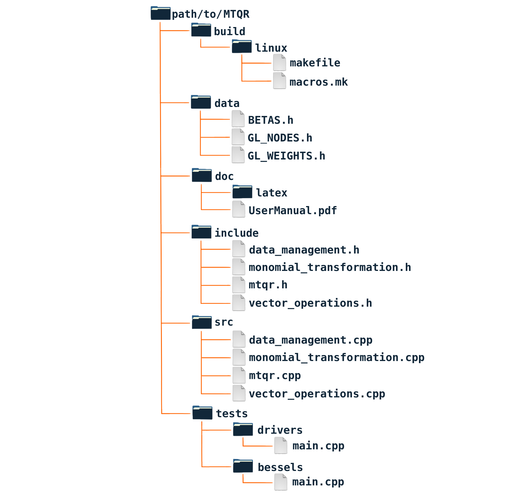
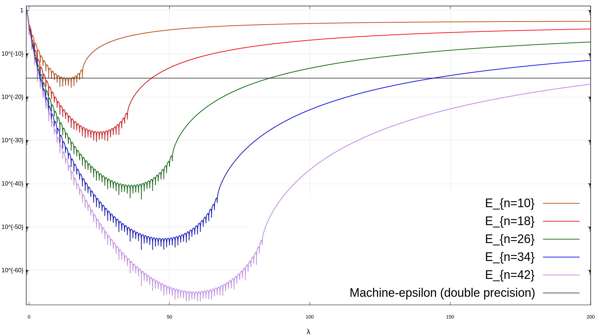

# MTQR - Monomial Transformation Quadrature Rule

We endevour to address and overcome some specific limitations with regards to the performances of contemporary adaptive and composite quadrature techniques for the numerical approximation of definite integrals of functions with endpoint singular/irregular behaviour and that can be modelled by generalised polynomials of non-integer-degree.

This repository consists of a cross-platform C++ library implementing the __Monomial Transformation Quadrature Rule__, an innovative algorithm based on a [paper](https://onlinelibrary.wiley.com/doi/abs/10.1002/nme.2684), published in 2009, and it is part of a broader work submitted for peer-review at [Computer Physics Communications](https://www.sciencedirect.com/journal/computer-physics-communications).

The software can run standalone applications or be integrated into larger codebases in scientific computing via links to its static library.

## Disclaimer

A full set of instructions, informative graphs, a mathematical background and general guidelines are discussed in a detailed _User Manual_ which is located in the `doc` subdirectory; you can either read the pdf print or compile the latex scripts within said directory. We __strongly advise__ any new user of the library to read the _User Manual_ for system-specific instructions regarding the correct installation and configuration of MTQR's dependencies, the compilation of the library itself, the execution of the proposed `tests` and the integration in larger applications. 

## Structure

The repository source code is organised as follow (_Figure 2.1_ of the _User Manual_).

## Dependencies

MTQR relies on two non-standard thrid-party libraries, both being open-source:

- [x]  [Boost Multiprecision](https://www.boost.org/doc/libs/1_82_0/libs/multiprecision/doc/html/index.html) header-only library for the implementation of the floating point data type in _quadruple precision_ (renamed in MTQR as `float128`);
- [x]  [GNU Scientific Library](https://www.gnu.org/software/gsl/doc/html/index.html) for root-finding algorithm and for testing and validation purposes, specifically:
	- [x]  the `gsl_integration_qags` function implementing the [adaptive Gauss-Kronrod tecnhique](https://www.gnu.org/software/gsl/doc/html/integration.html#qags-adaptive-integration-with-singularities);
	- [x]  the `gsl_sf_bessel_Jnu` function for evaluating [Bessel functions of fractional orders](https://www.gnu.org/software/gsl/doc/html/specfunc.html#regular-bessel-function-fractional-order).

## Building the library

We used `CMake` to achive cross-platform compatibility in compiling and linking the source code. For detailed information we refer to _Chapter 2_ of the _User Manual_.

## Benchmarks

In the `tests` subdir we implement two cases: `drivers` is useful to get familiar with the fundamentals of MTQR and its two modes of execution _loud_ and _silent_ (see _Chapter 3_ of the _User Manual_); `bessels` indicates and example of how MTQR can be applied to real-word applications in computational science and engineering by computing the definite integrals of Bessel functions (of the first kind) of fractional order. MTQR is designed to always achieve machine-epsilon precision (in double floating format format) by manipulating the minimum and maximum real exponents of the input generalised polynomials and shifting them between a continuous-regions that falls below such accuracy treshold as shown below (_Figure 1.1_ of the _User Manual_).

Other tests can be found in the work submitted for peer-review at Computer Physics Communications.
